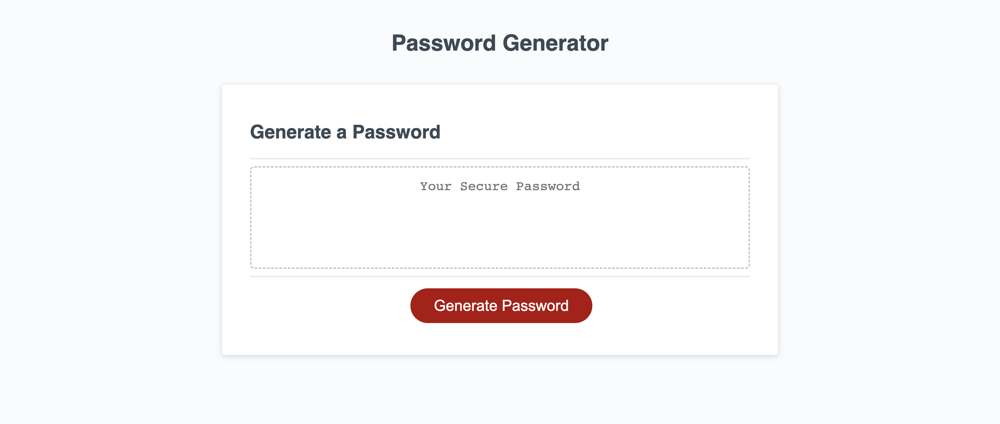

# Password Generator

## UCLA Bootcamp Module 3 Assignment

## Description

This project is a password generator. It will prompt the user for the following using window prompts:

1. How many characters should the password be?

2. Does the password need the following criteria:
- Uppercase letters
- Lowercase letters
- Special lharacters
- Numbers

3. It will then generate a password based on the answers to the above questions and display it on the webpage.

## Installation

This project can be used via GitHub pages at https://ramitaarora.github.io/password-generator/

## Usage

## Credits

This password generator was created by Ramita Indurkhya.